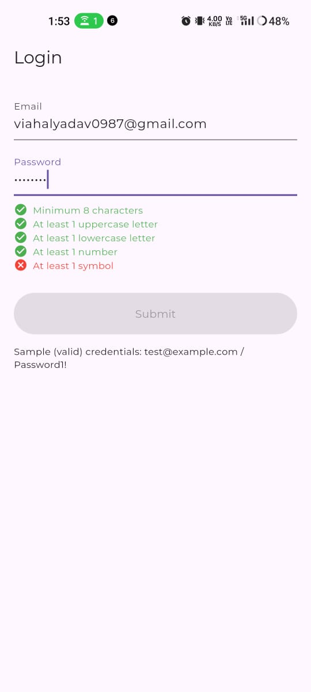
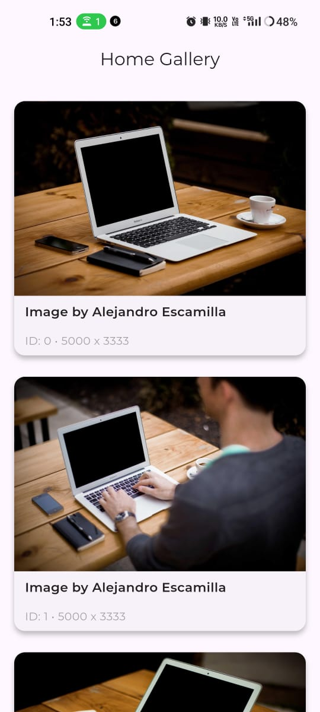

# 🍳 Authentication Bloc

<div align="start">
  
  
  
</div>

---

## 📱 App Overview

A minimal Flutter recipe app demonstrating **BLoC state management** with two main screens:

- **Login Screen** – Secure user authentication  
- **Home Screen** – Display recipes fetched from API

This project serves as a foundation for building scalable Flutter apps using BLoC architecture.

---

Sure! Here’s a typical section you can add to your README that includes the APK download link and the command to build a Flutter app:

---

## APK Link

* **Download APK:** https://drive.google.com/file/d/1rX0NWuAIYyIA6q5UvURnbXsBe5RP2dh1/view?usp=drivesdk

---

## Build Flutter App

To build the APK for your Flutter app, run the following command in your project directory:

```bash
flutter build apk --release
```

This will generate a release APK in the `build/app/outputs/flutter-apk/` folder.

---


## 📸 Screenshots

| Login Screen | Home Screen |
|--------------|-------------|
|  |  |

---

## 🚀 Features

- 🔐 User login with validation  
- 📋 Display list of recipes on home screen  
- 🔄 State management using BLoC  
- 📶 Network request handling with error states

---

## 🛠️ Tech Stack

- **Flutter**  
- **Dart**  
- **flutter_bloc** (BLoC pattern)  
- **HTTP package** for API calls  

---

## 📂 Project Structure

```

lib/
├── blocs/           # Business logic components (BLoC)
├── models/          # Data models
├── screens/         # UI Screens (Login, Home)
├── widgets/         # Reusable widgets
├── services/        # API and data services
└── main.dart        # App entry point

````

---

## 📋 Setup Instructions

1. **Clone the repo:**

```bash
git clone https://github.com/vishalyadav0987/Authentication-Bloc.git
cd authentication-bloc
````

2. **Install dependencies:**

```bash
flutter pub get
```

3. **Run the app:**

```bash
flutter run
```

---

## 📄 License

This project is licensed under the MIT License. See the [LICENSE](LICENSE) file for details.

---

## 🙏 Acknowledgments

* Thanks to the Flutter and BLoC communities for amazing tools and resources.

---

## 📞 Contact

If you have any questions, feel free to reach out:
📧 [viahalyadav0987@gmail.com](mailto:viahalyadav0987@gmail.co)

---

<div align="center">
  <sub>🍳 Happy Cooking with Flutter! 👨‍🍳👩‍🍳</sub>
</div>
